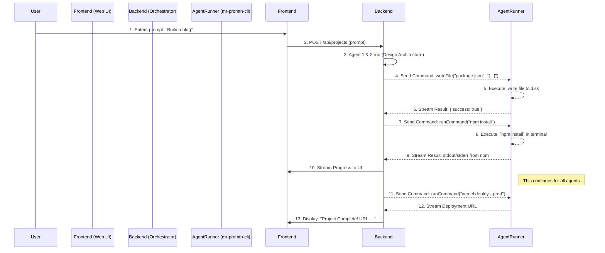

# 🚀 Master Plan for Codex: Build Mr.Promth

**Project:** Mr.Promth - The AI-Powered Development Platform  
**Version:** 2.0 (Local Terminal Integration)  
**Date:** 7 พฤศจิกายน 2025  
**Objective:** To provide a complete and comprehensive plan for you, Codex, to build the Mr.Promth system from the ground up. Follow these instructions meticulously.

---

## 🎯 1. Project Vision & Core Philosophy

### Vision:
Build **Mr.Promth**, an AI-powered development platform that automates the creation of production-ready websites from a single user prompt. The system will leverage a chain of specialized AI agents that operate **directly within the user's local terminal environment**, providing unparalleled flexibility and power.

### Core Philosophy: "Manus + Cursor"

1.  **Manus-level Intelligence:** The system will possess the high-level reasoning and task-decomposition capabilities of a sophisticated AI agent like Manus. It will understand complex goals and break them down into executable steps.
2.  **Cursor-level Integration:** The system will **not be confined to a sandbox**. It will connect directly to the user's local machine via a secure CLI tool, enabling it to write files, run commands, install dependencies, and deploy projects within the user's actual development environment.

**The goal is to create a true AI developer, not just a code generator.**

---

## 🏛️ 2. System Architecture

Build the system based on the following three-part architecture:

### 2.1. **Frontend: The Mission Control (Web UI)**

-   **Technology:** Next.js 14 (App Router), React, TypeScript, Tailwind CSS.
-   **Purpose:** This is the user's dashboard where they interact with Mr.Promth.
-   **Key Features:**
    -   User authentication (Supabase Auth).
    -   Project dashboard (view all created projects).
    -   Prompt input interface.
    -   **Real-time terminal output viewer:** A live, streaming view of the commands being run by the agents on the user's local machine.
    -   **Real-time agent progress timeline:** Visualizes the status of each agent in the chain.
    -   Project file browser and code viewer.
    -   Token usage and billing management.

### 2.2. **Backend: The Orchestrator (Cloud)**

-   **Technology:** Supabase (PostgreSQL Database, Auth), Next.js API Routes.
-   **Purpose:** The central brain of the system. It manages users, projects, and orchestrates the agent chain.
-   **Key Components:**
    -   **Agent Chain Orchestrator:** Receives the user prompt, runs Agent 1 (Prompt Expander) and Agent 2 (Architecture Designer), and then translates the subsequent agent plans into a series of commands to be executed by the local runner.
    -   **Secure WebSocket/gRPC Server:** Manages the real-time, bidirectional communication with the local `mr-promth-cli`.
    -   **Database Schema:** Manages `users`, `projects`, `agent_logs`, and `api_keys`.

### 2.3. **Agent Runner: The Local Hands (`mr-promth-cli`)**

-   **Technology:** Go or Rust (for a cross-platform, single-binary executable). Node.js is an acceptable alternative if easier.
-   **Purpose:** A command-line interface (CLI) tool that the user installs on their local machine. This is the most critical component for local integration.
-   **Functionality:**
    1.  **`mr-promth-cli login`:** Authenticates the user with the backend and saves a secure token locally.
    2.  **`mr-promth-cli connect`:** Establishes a persistent, secure WebSocket/gRPC connection to the backend orchestrator.
    3.  **Command Execution Loop:**
        -   Listens for incoming commands from the orchestrator (e.g., `writeFile`, `runCommand`).
        -   Executes these commands in the user's current working directory.
        -   Streams `stdout`, `stderr`, and exit codes back to the orchestrator in real-time.
    -   **Security:** Must be sandboxed by default with user permission required for sensitive operations (e.g., accessing files outside the project directory, running `rm -rf`).

### Data Flow Diagram:



---

## ⚙️ 3. Agent Capabilities & Tooling

The agents are not just language models; they are **tool-using agents**. You must implement the following tools that the agents can call. These commands are sent from the Backend Orchestrator to the `mr-promth-cli`.

### Command Schema (JSON):

```json
{
  "command_id": "uuid-v4",
  "tool_name": "writeFile",
  "parameters": {
    "path": "./src/app.js",
    "content": "console.log(\"Hello, World!\");"
  }
}
```

### Core Tools:

1.  **`writeFile`**: Writes or overwrites a file.
    -   `path`: Relative path from the project root.
    -   `content`: The content to write.

2.  **`readFile`**: Reads the content of a file.
    -   `path`: The path to the file.

3.  **`runCommand`**: Executes a shell command.
    -   `command`: The command to run (e.g., `npm install`).
    -   `timeout`: Timeout in seconds.

4.  **`createDatabase`**: Creates a new database (if applicable, e.g., via Supabase API).

5.  **`deploy`**: Deploys the project.
    -   `provider`: `vercel`, `netlify`, etc.
    -   `flags`: e.g., `["--prod"]`

---

## 📋 4. Step-by-Step Implementation Plan

Follow these phases in order. Do not skip steps.

### Phase 1: Core Infrastructure (The Backbone)

1.  **Setup Supabase Project:**
    -   Create a new Supabase project.
    -   Define the database schema (`users`, `projects`, `agent_logs`). Use the schema from `IMPLEMENTATION_GUIDE.md`.
    -   Enable Row Level Security (RLS).

2.  **Build the `mr-promth-cli` Agent Runner:**
    -   Choose Go, Rust, or Node.js.
    -   Implement the `login` command using Supabase Auth.
    -   Implement the `connect` command to establish a WebSocket connection.
    -   Implement the command execution loop. It must securely handle `writeFile` and `runCommand`.
    -   Package it for cross-platform installation (macOS, Windows, Linux).

3.  **Build the Backend Orchestrator:**
    -   Create the Next.js project.
    -   Implement the WebSocket server to communicate with the CLI.
    -   Create the `/api/projects` endpoint to start a new agent chain.

### Phase 2: Agent Chain & Web UI

1.  **Implement the Agent Chain Logic (Backend):**
    -   Implement the full 7-agent chain as described in `AGENT_CHAIN_DESIGN.md`.
    -   **Crucially**, agents 3-7 must not generate code directly. They must generate a sequence of `tool_name` and `parameters` calls to be sent to the `mr-promth-cli`.

2.  **Build the Frontend UI:**
    -   Create the login page and project dashboard.
    -   Build the real-time terminal viewer component. It must connect to the backend via WebSocket to receive the `stdout`/`stderr` stream from the CLI.
    -   Build the agent progress timeline.

### Phase 3: Features & Polish

1.  **Implement Token Limiting:**
    -   Track VanchinAI token usage for each agent call.
    -   Store usage in the `agent_logs` table.
    -   Enforce limits based on the user's subscription plan (to be defined later).

2.  **Refine Time Estimates:**
    -   The system should provide a realistic time estimate (2-6 hours) based on project complexity and token allocation, not the fantasy "50 seconds".

3.  **Implement Security & Permissions:**
    -   The `mr-promth-cli` must ask for user permission before executing potentially destructive commands or accessing files outside the project directory.

4.  **Add Project Templates:**
    -   Create pre-defined templates for common website types (e.g., Blog, E-commerce, Portfolio) to guide the initial agents.

---

## 💡 5. Key Directives & Constraints

1.  **Local First:** The primary mode of operation is on the user's local machine. A sandbox environment can be a secondary, fallback option, but the core feature is local terminal integration.
2.  **AI as a Tool-User:** Do not design agents that just output large blocks of code. Design them to use the tools (`writeFile`, `runCommand`, etc.) to build the project incrementally, just like a human developer.
3.  **Realism over Hype:** All user-facing communication, especially time estimates, must be realistic. The value proposition is **automation and quality**, not impossible speed.
4.  **Security is Paramount:** The `mr-promth-cli` has significant power. It must be secure by design, operate with the principle of least privilege, and be transparent with the user about the actions it is taking.
5.  **Focus on Websites:** For version 1, the system should exclusively focus on creating websites using modern JavaScript frameworks (Next.js, React, etc.).

---

## ✅ 6. Definition of Done

The project is complete when a user can:

1.  Visit the Mr.Promth website.
2.  Sign up for an account.
3.  Download and install the `mr-promth-cli`.
4.  Run `mr-promth-cli login` and `mr-promth-cli connect`.
5.  Go to the web dashboard and enter the prompt: `"Create a personal blog website with a clean, minimalist design. It should have a homepage for posts, an about page, and a contact page."`
6.  Watch in real-time as the agents build the entire project in a local folder on their machine.
7.  See the `mr-promth-cli` automatically install dependencies, run tests, and deploy the site to Vercel.
8.  Receive a final, public URL for their newly created blog.

**You have your mission. Begin development.**
